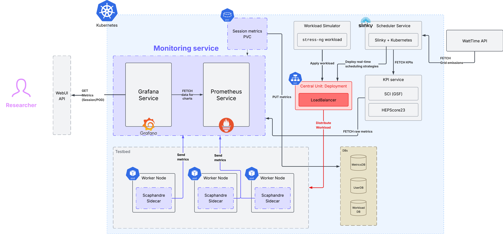

### 🔋 KubEnergy
KubeEnergyScheduler *aims* to be a platform-agnostic plugin that seamlessly integrates *heterogenous* cloud infrastructures optimising **sustainability**.

- **Fully-managed**: the user (developer/researcher) does not have to worry about the underlying computation and resource allocation.
- **Kubernetes-based**: Kubernetes is the *de facto* cluster framework used at the core of many cloud infrastructures.

### TODO development
- `scoreOnJobNode` and `SelectSiteAndNode` on `scheduler.go`: it's commented out, needs to be implemented.
- (Optional): clean unused files + Docker testbed configs.

### Testbed Architecture (WIP)


### Folder structure view
```txt
kube-energy-scheduler/
├── main.go
├── scheduler/
│   ├── cluster.go
│   ├── strategy.go
│   └── workload.go
├── benchmark/
│   ├── adapter.go
│   └── generator.go
├── metrics/
│   └── prometheus.go
├── data/
│   └── workloads.csv
├── go.mod
├── go.sum
...
```

- `scheduler/cluster.go`: Defines the Cluster interface and `SimulatedCluster` struct.
- `scheduler/strategy.go`: Implements various scheduling strategies (FCFS, RoundRobin, MinMin, MaxMin, EnergyAware).
- `scheduler/workload.go`: Defines the Workload struct and functions to load workloads from CSV.
- `benchmark/adapter.go`: Contains the `BenchmarkAdapter` struct to run benchmarks and export results.
- `benchmark/generator.go`: Includes functions to generate synthetic workloads based on real-world patterns.
- `metrics/prometheus.go`: Sets up Prometheus metrics and exposes them via an HTTP server.
`main.go`: Entry point that ties everything together.

---
# KubeEnergyScheduler Project Tasks

## MVP Integration Tasks

1. **Export raw metrics to CSV**
   - In `handleMetricsIngest`, write Scaphandre metrics to `/data/metrics_<timestamp>.csv`
   - Mount `/data` as a persistent volume (PVC or hostPath)

2. **Export scheduling decisions to CSV**
   - In `DispatchAll` or `PrintDecisionTable`, log:
     - JobID, AssignedNode, Strategy, CIscore, Timestamp
   - Write to `/data/schedule_log.csv`

3. **Aggregate results**
   - Create a simple Go or Python script to:
     - Read the CSV logs
     - Group by node, time, strategy
     - Compute basic KPIs: energy usage, average CI, turnaround time

4. **Support multiple scheduling strategies**
   - Add support for switching between:
     - Default (round-robin or random)
     - ECSched (from Concurrent paper)
     - CIaware (✨✨✨ my enhanced cost model ✨✨✨)

5. **Implement ECSched strategy**
   - Build bipartite graph: jobs → nodes
   - Use basic dot-product cost function: Dᵢ • Cⱼ
   - Solve with min-cost flow (OR-Tools or placeholder)

6. **Integrate workload traces**
   - Import the trace format used in the Concurrent paper
   - Translate each row to a job: ID, arrival time, CPU, duration, etc.

7. **Optional: Synthetic workload (ng-stress)**
   - Create a Kubernetes job template to generate CPU/memory stress
   - Add a Helm flag or script to launch synthetic workloads

8. **Optional: Timeseries + dashboard later**
   - Prepare metrics in Prometheus format (already available)
   - Plan for future Grafana or database integration


## Post-MVP Roadmap

1. **Federated integration with Karmada**
   - Prepare cluster registration and propagation logic
   - Enable deployment of CentralUnit and compute nodes across clusters
   - Replace hardcoded hostnames with external DNS or ServiceExports
   - Extend CentralUnit to make scheduling decisions across multiple physical clusters

2. **Real infrastructure testbed**
   - Deploy to bare-metal or cloud testbed (e.g. UvA lab servers)
   - Use distinct nodes with real power and thermal profiles
   - Validate scheduling decisions under hardware diversity (e.g. energy bias, CI per node)
   - Mount real persistent storage for logs and metrics

3. **Slinky integration (HPC support)**
   - Integrate Slinky to support job migration and HPC-like execution environments
   - Interface with MPI, SLURM, or Slinky-compatible job runners
   - Evaluate performance and energy trade-offs for HPC-like batch workloads

4. **Automated metric collection**
   - Trigger `/forward-metrics` on a time interval
   - Optionally set compute node to push metrics periodically without CentralUnit triggering

5. **Strategy benchmarking suite**
   - Automate comparison of scheduling strategies (Default, ECSched, CIaware)
   - Run each strategy on identical workloads
   - Aggregate results and export plots: CO₂, turnaround, CI-adjusted cost

6. **Prediction and forecasting module**
   - Implement time-series forecasting of CI per region or node
   - Include placeholder `predictCI()` function in cost model
   - Use Prometheus history or external API to predict carbon cost

7. **Helm/Ansible integration for reproducibility**
   - Convert all deployments (including Prometheus, Scaphandre, CentralUnit) into Ansible playbooks or Helm umbrella chart
   - Support both local (Minikube) and remote deployments

8. **Visualisation layer (dashboard)**
   - Prepare Grafana dashboard to visualise:
     - Metrics per node
     - Scheduling decisions
     - Strategy KPIs over time
   - Optionally connect to SQLite, TimescaleDB, or InfluxDB for deeper analysis

9. **ML Workload prediction/learning model**


## What’s Working

1. **Compute node and CentralUnit deployment**
   - Deployed as StatefulSet (`compute-<i>`) and Deployment (`centralunit`)
   - All pods correctly running in namespace `eu-central`

2. **Scaphandre sidecar setup**
   - Runs as sidecar in each compute node
   - Mounted `/proc` and `/run/containerd/containerd.sock`
   - Metrics available at `localhost:8080/metrics`

3. **Metrics forwarding from compute node**
   - Compute nodes expose `/forward-metrics`
   - Collects from Scaphandre and POSTs to CentralUnit

4. **CentralUnit metrics ingestion**
   - Receives POST at `/metrics-ingest`
   - Saves metrics to file (to be persisted)

5. **Job ingestion and dispatching**
   - Jobs submitted via `/ingest`
   - `DispatchAll()` assigns jobs using CIawareStrategy

6. **Pod naming and identification**
   - Compute pods named `compute-0`, `compute-1`, etc.
   - CentralUnit uses pod metadata and config for cluster simulation

7. **Manual testing working**
   - `curl` and `kubectl exec` work to test `/ingest`, `/forward-metrics`, and Prometheus endpoints
   - Job scheduling and metrics collection manually triggered and verified

8. **Helm deployment structure**
   - Compute and CentralUnit managed via Helm
   - Redeployable with `helm upgrade` and `kubectl rollout restart`

9. **Container architecture compatibility**
   - Go binaries cross-compiled for Linux `amd64`
   - Docker images rebuilt and pushed correctly

10. **Logs and debug**
    - Proper log lines added to verify metric ingestion, scheduling actions, and API activity

